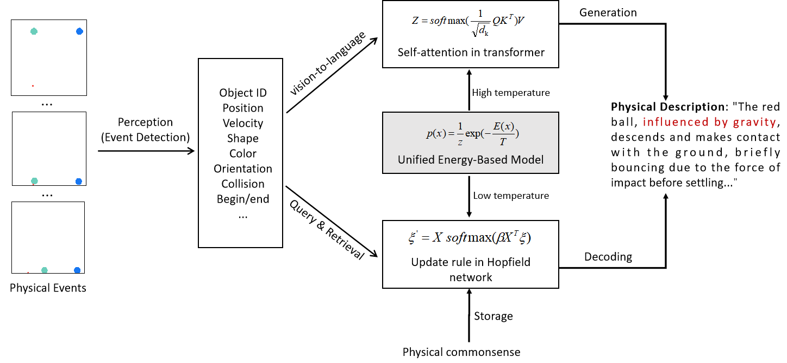

# Physical-Commonsense

## The pipeline of the work

## Data preparation

This project depends on the following repository for data:

- [ESPRIT Dataset](https://github.com/salesforce/esprit) - This repository contains the necessary data files.

## Code structure

### Alignment pretrain

**Data_Generation.py**: Read all collision entries in the table annotations, use the hand-crafted rule to create data pairs, and save.

**Pretrain_Encoder**: Use MLP to align the vectorized event table (generated by Data_Generation.py) with the T5 embeddings of the corresponding physics rule.

### Main Experiments
**main.py**: Main experiment entry. Extract physics features, encode them into latent variables, use Hopfield Networks to retrieve relevant physical rules, and integrate them into table-to-text outputs.

### Utils
**T5AutoEncoder.py**: Construct an auto-encoder by prompting T5 model. Embed some physical commonsense into fixed-length embeddings.

**gpt_utils.py**: Table-to-text and interaction with GPT functions.

**HopfieldNetworks.py**: Implementation of [Mordern Hopfield Networks](https://github.com/BerenMillidge/Theory_Associative_Memory).
